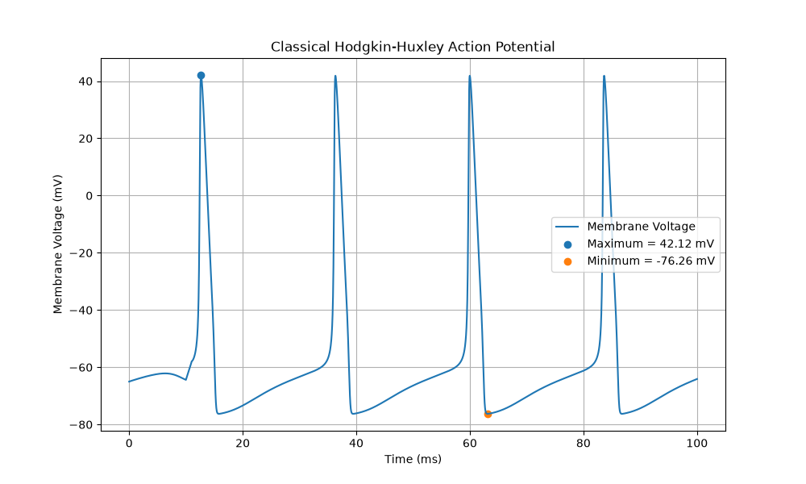
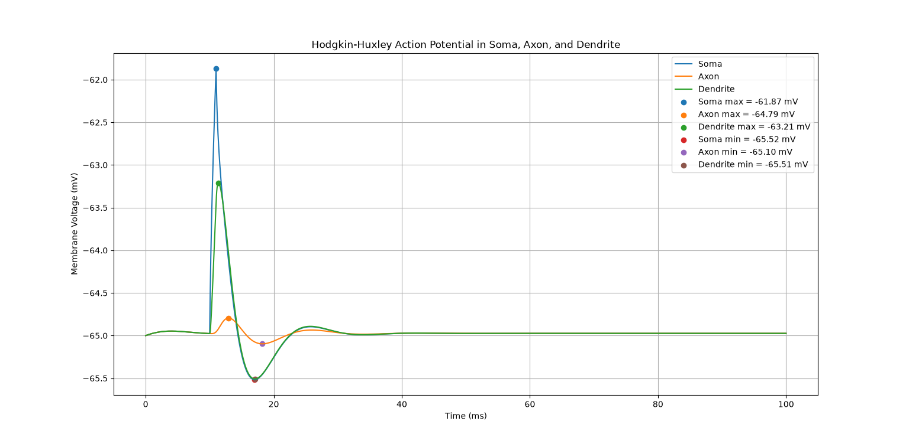
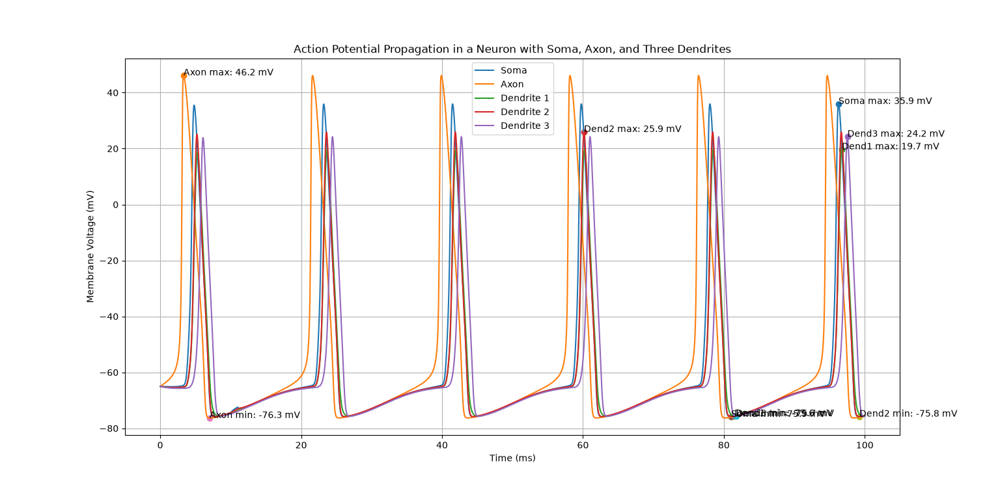
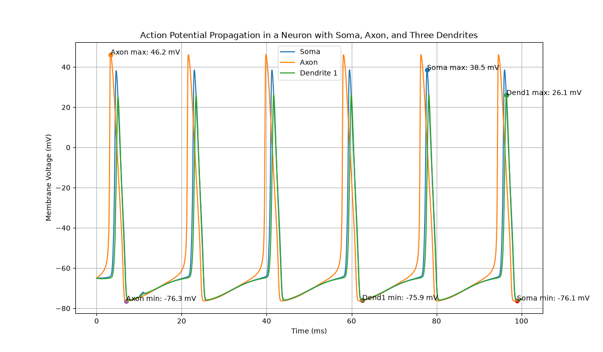
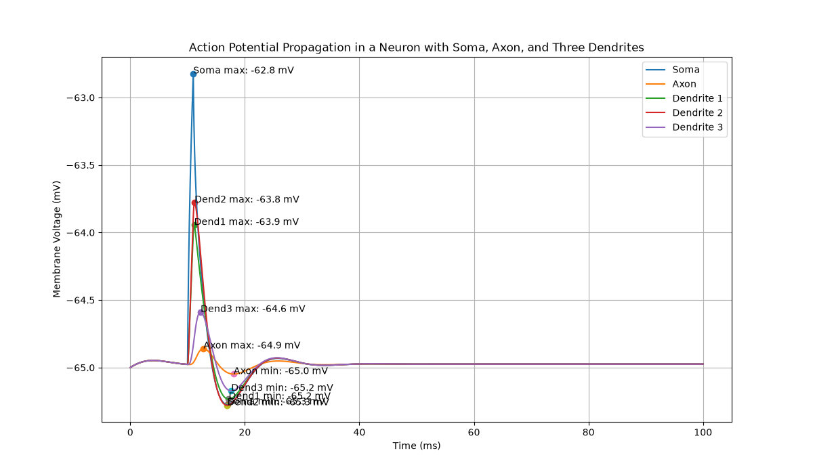

# hh0 : Classic hh Model only with soma

If we increase the sodium conductance to more than 0.19, the action potential becomes a repetitive pattern.

# hh1 : Classic hh model with soma, axon, dendrite

# hh2 : 3 dendrites + changing sodium conductance

An action potential initiated near the soma produces a local depolarization that spreads electrotonically through the connected neuronal membrane. When this depolarization reaches regions containing voltage-gated sodium channels, those channels can open and produce additional inward sodium current.

The magnitude and regenerative ability of the action potential depend on both the electrical distance from the initiation site and the local density of voltage-gated sodium channels.

We reproduced the same conditions as in the first experiment. A current of 0.1nA was injected for  1ms after 10 ms of delay. To understand why in the second experiment we more than 1 action potential, we should take into account that the external stimulus only injected current once.

When using the Hodgkin-Huxley model, containing sodium, potassium and leak channels, more peaks may appear. This is because when the membrane reaches threshold, the sodium channels open and generate an action potential. Later, the potassium channels activate and repolarize the membrane.

If we run the simulation for more time we can observe that neuron is firing continuosly, therefore, it has most-likely enteres+d a repetitive firing regime. This happens when the input is sufficient enough to push the membrane into sustained repetitive activity.

The main reason may be due the change of the sodium conductance in the different part of the neuron.

- Soma       0.12 S/cm²
- Axon       0.30 S/cm²
- Dendrites  0.05 S/cm²

Moreover, is interesting to see that the higher the Na conductance, the bigger the spike:

- Axon       ~46 mV
- Soma       ~36 mV
- Dendrite 2 ~26 mV
- Dendrite 3 ~24 mV
- Dendrite 1 ~20 mV

Moreover the electrical topology of our neuron also modifies the result:

soma(0)
   |
   +------ dend1 ------ dend3
   |
   +------ dend2

soma(1)
   |
  axon

This is why dendrite 3, despite having the same sodium conductance as dendrite 1, it will show different behaviour because of its distance from the soma, from which the current is being injected. 

**NEW SIGNIFICANCE**
By changing the duration and the magnitude of the current to 0, it was seen that the repetitive pattern was still firing. At first, it may seem as an error of the code, however, we carried out another two experiments to understand the reason behind this pattern. 

## hh2a and hh2b

Two more experiments were carried out in which we separated the geometry and the change of the sodium conductance, with the same code used in **hh2**. With this we can observe that the actual reason for the repetitive firing pattern was due the change in the sodium conductance.

Increasing sodium conductance in the Hodgkin-Huxley model means increasing $\bar{g}_{Na}$, which also means increasing the amount of sodium current that can flow. 

- **SODIUM CURRENT**

$$
I_{Na} = \bar{g}_{Na} m^3 h (V - E_{Na})
$$

- But, why does it produce *REPETITIVE* firing?

# DISEASES WHERE SODIUM-CHANNEL DYSFUNCTION IMPACTS: Epilepsy and genetic channelopathies

- Voltage-gated sodium channels are crucial for action-potential generation and propagation, and abnormal sodium-channel function can cause neuronal hyperexcitability. Mutations affecting sodium-channel genes can alter activation, inactivation, persistent sodium current, or channel expression. These changes can shift neurons toward excessive firing and contribute to epilepsy.

- One particularly interesting example for a computational project is:

**SCN8A→Nav1.6**: Nav1.6 is a voltage-gated sodium channel strongly involved in neuronal excitability, including at the axon initial segment and nodes of Ranvier.

Some gain-of-function SCN8A mutations can increase sodium-channel activity.

For example, mutations can cause:

- channels to activate too easily
- channels to inactivate too slowly
- increased persistent sodium current
- increased repetitive firing

These changes can lead to neuronal hyperexcitability and epileptic encephalopathy

- **Epilepsy / sodium-channel dysfunction**

"Increasing sodium-channel conductance can increase neuronal excitability and promote repetitive firing, providing a simplified computational model of how altered voltage-gated sodium-channel function may contribute to epileptic hyperexcitability."