# Experiment 01 Current Threshold

## Experiments

**Current 0nA**

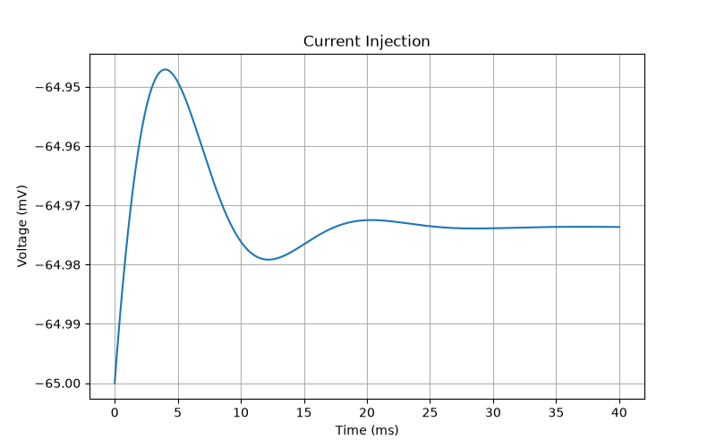

**Current 0.01nA**

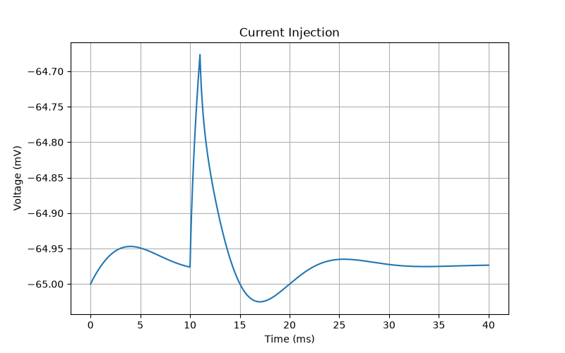

**Current 0.05nA**

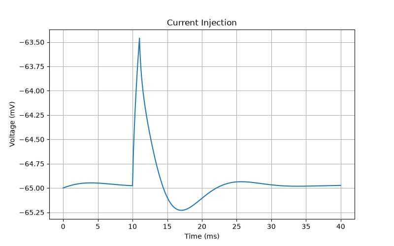

**Current 0.1nA**

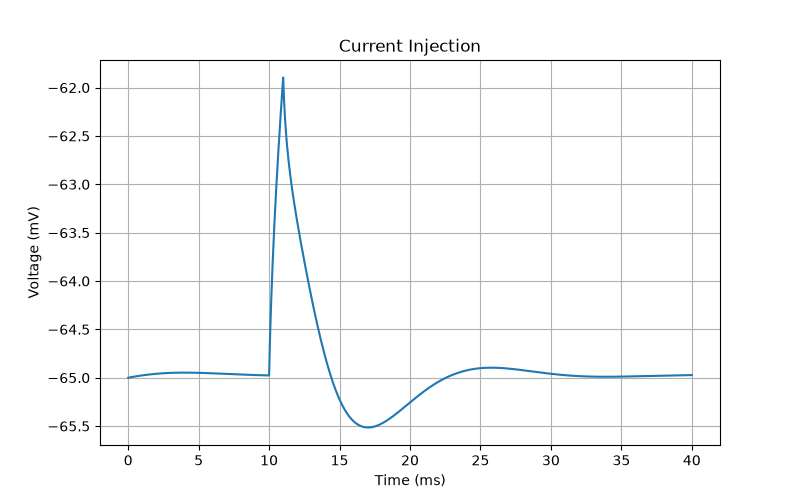

**Current 0.2nA**

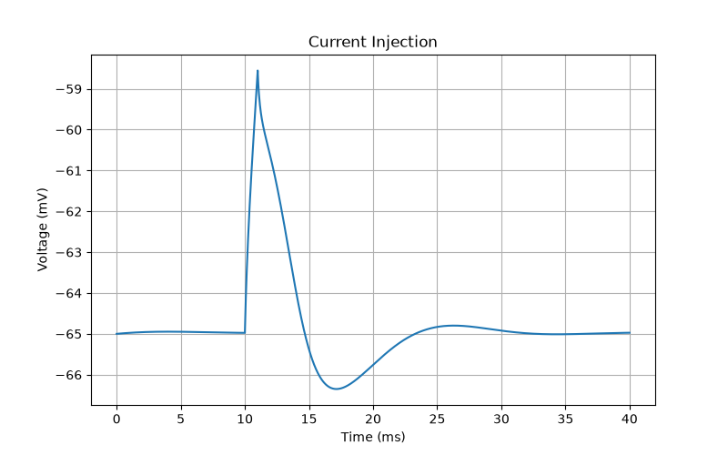

**Current 0.25nA**

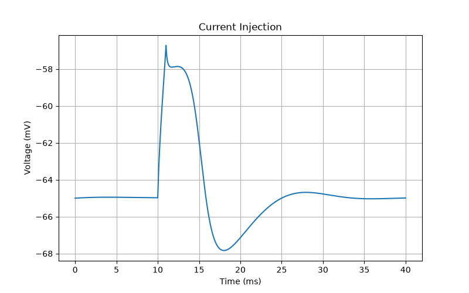

**Current 0.252nA**

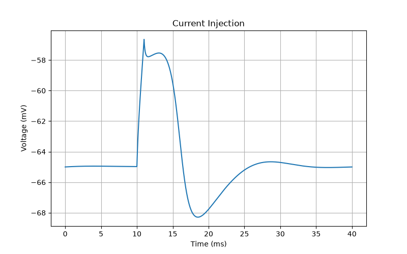

**Current 0.253nA**

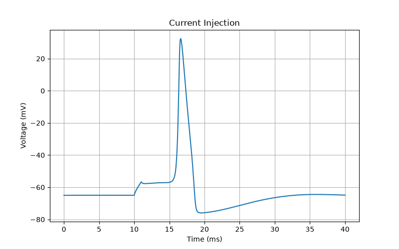

**Current 0.26nA**

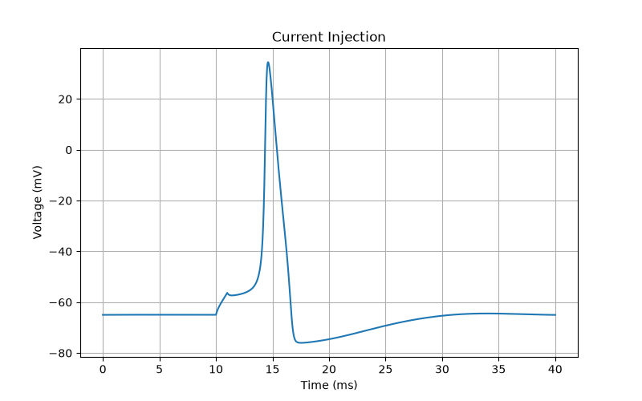

**Current 0.3nA**

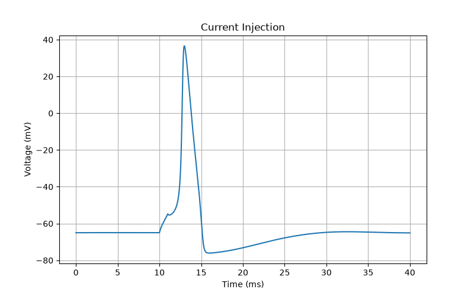

**Current 0.4nA**

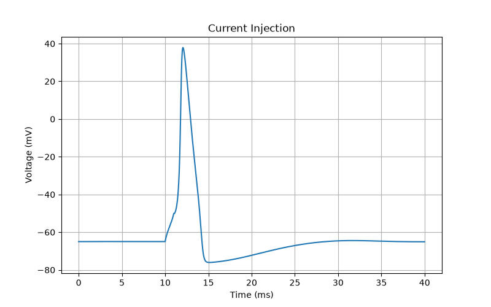

**Current 0.5nA**

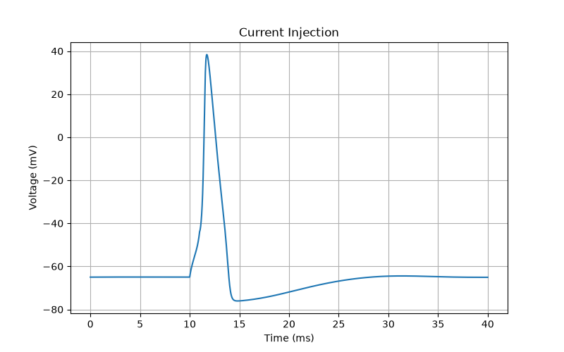

**Current 1nA**

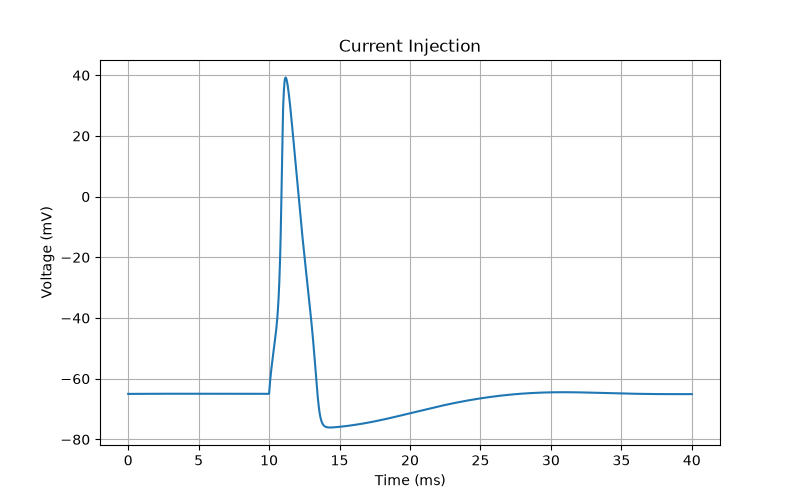

**Current 10nA**

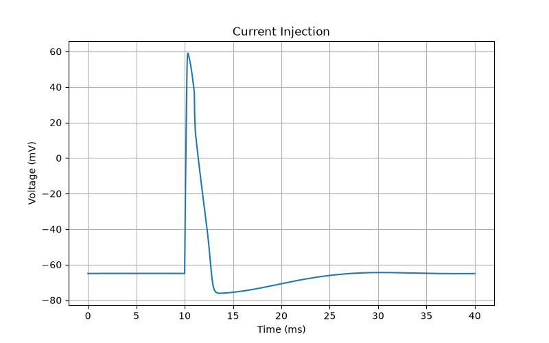

## Analysis

**Why does the action potential suddenly appear at 0.253 nA?**

Mathematically, the Hodgkin–Huxley model is nonlinear. This is the key idea.

When a current is injected, the membrane follows

The injected current (Iinj) tries to increase the membrane voltage.

At the same time, sodium, potassium and leak currents oppose this change.

For currents smaller than about 0.252 nA, the injected current is not large enough to depolarize the membrane to the activation threshold of the sodium channels. Only a small fraction of sodium channels open, and the leak and potassium currents are able to return the membrane to its resting potential. The neuron therefore exhibits only a small depolarization.

However, at approximately 0.253 nA, the membrane reaches the voltage at which the sodium activation gates (m) begin opening rapidly. This creates a positive feedback loop:

The membrane depolarizes slightly.
More sodium channels open.
More sodium enters the cell.
The membrane depolarizes even more.
Even more sodium channels open.

This positive feedback causes the membrane potential to rise explosively, producing a full action potential. Therefore, the transition from 0.252 nA to 0.253 nA is not because that exact number is special, but because your neuron has reached its excitation threshold.

**Why does the voltage go below the resting potential after the spike?**

This part is called the after-hyperpolarization (AHP).

During the rising phase of the action potential, sodium channels open very rapidly and sodium ions enter the neuron.

A short time later:

sodium channels begin to inactivate,
potassium channels open more slowly.

At that moment, potassium channels remain open even after the sodium current has disappeared.

Potassium leaves the neuron, carrying positive charge out of the cell.

Because potassium channels close slowly, the membrane temporarily becomes more negative than the resting potential.

This is why the voltage trace looks like

           Spike
             /\
            /  \
-----------/    \---------
                  \
                   \
                    \____
                        \
                         \____ Resting potential

The small dip below the resting potential is completely normal and is one of the defining characteristics of a Hodgkin–Huxley action potential.

**Why do larger currents produce almost the same peak voltage?**

Another important property of neurons is that action potentials are all-or-none events.

Once the membrane reaches threshold, nearly all available sodium channels open. Consequently, the peak voltage is determined mainly by the sodium and potassium conductances and their equilibrium potentials, rather than by the injected current itself.

Increasing the injected current from 0.3 nA to 5 nA therefore does not produce a spike that is ten or twenty times larger. Instead, it generally:

makes the neuron reach threshold sooner,
can increase the firing frequency if the current lasts long enough,
but produces action potentials with approximately the same peak voltage (typically +30 to +45 mV in the classical Hodgkin–Huxley model).

This behavior is another consequence of the nonlinear dynamics of voltage-gated ion channels.

**Report**

When the injected current was gradually increased from 0.00 nA to approximately 0.25 nA, the neuron remained in the subthreshold regime. The membrane potential exhibited progressively larger depolarizations as the injected current increased, but the voltage always returned to its resting value without generating an action potential. At 0.00 nA, the membrane remained essentially at the resting potential (approximately −65 mV), whereas increasing the current produced progressively larger voltage deflections. These responses reflect the passive charging of the membrane capacitor before the activation threshold of the voltage-gated sodium channels is reached.

A sharp transition occurred between 0.252 nA and 0.253 nA, where the neuron changed abruptly from producing only a small depolarization to generating a full action potential. This sudden change is a consequence of the nonlinear Hodgkin–Huxley equations. Below the threshold, sodium channel activation is insufficient to overcome the outward potassium and leak currents. Once the threshold is exceeded, however, sodium channel activation becomes regenerative: a small depolarization opens sodium channels, sodium influx further depolarizes the membrane, and this positive feedback rapidly drives the membrane potential to approximately +40 mV. Therefore, the threshold current is not a special physical constant but rather the minimum current required for this positive feedback mechanism to become self-sustaining in the particular neuron model used.

For injected currents greater than the threshold (approximately 0.3 nA and above), the neuron generated action potentials with very similar amplitudes despite the large increase in current. This demonstrates the all-or-none nature of action potentials. Once threshold is reached, the peak voltage is determined primarily by the intrinsic properties of the sodium and potassium channels rather than by the magnitude of the injected current. Increasing the current mainly reduces the latency to the first spike and, for sufficiently long current injections, increases the firing frequency rather than the height of each action potential. Following each spike, the membrane potential briefly became more negative than the resting potential because potassium channels remain open after sodium channels have inactivated, producing the characteristic after-hyperpolarization observed in Hodgkin–Huxley neurons.