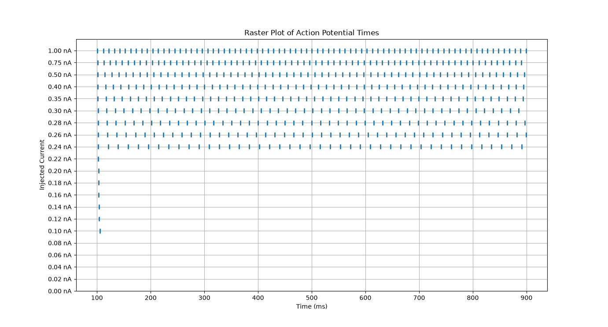
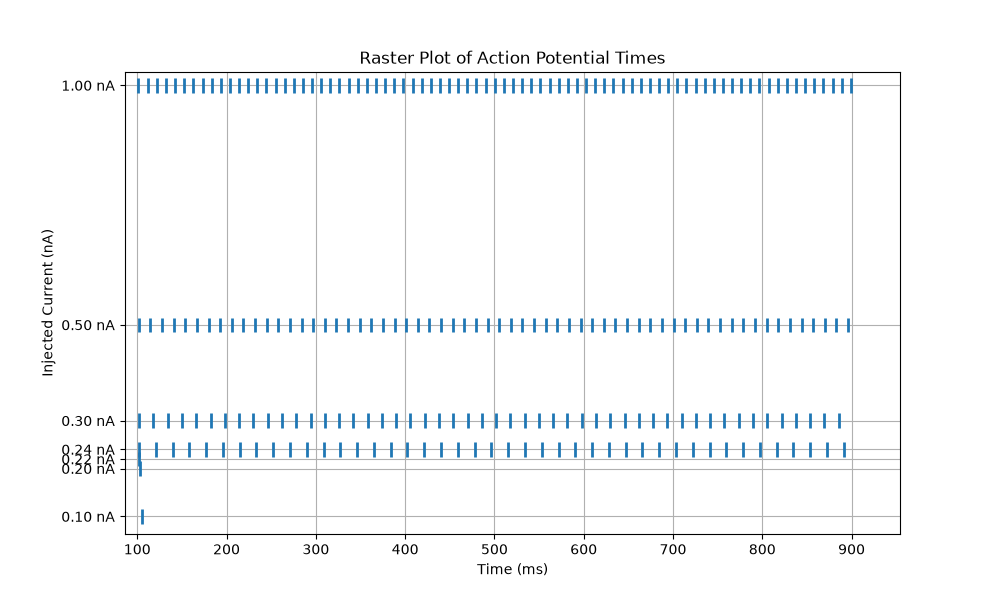

# Current Amplitude Vs Firing Frequency

In this experiment, the injected current was gradually increased while recording the neuron's electrical response. For each current amplitude, the number of action potentials (spikes), the firing frequency, and the time of the first spike were measured. The objective was to determine the threshold current required to trigger repetitive firing and to investigate how neuronal activity changes as the injected current increases.

## 1. Results

| Injected Current (nA) | Number of Spikes | Firing Frequency (Hz) | First Spike Time (ms) |
| --------------------: | ---------------: | --------------------: | --------------------: |
|                  0.00 |                0 |                  0.00 |                     — |
|                  0.02 |                0 |                  0.00 |                     — |
|                  0.04 |                0 |                  0.00 |                     — |
|                  0.06 |                0 |                  0.00 |                     — |
|                  0.08 |                0 |                  0.00 |                     — |
|                  0.10 |                1 |                  1.00 |                105.40 |
|                  0.12 |                1 |                  1.00 |                104.23 |
|                  0.14 |                1 |                  1.00 |                103.60 |
|                  0.16 |                1 |                  1.00 |                103.20 |
|                  0.18 |                1 |                  1.00 |                102.88 |
|                  0.20 |                1 |                  1.00 |                102.65 |
|                  0.22 |                1 |                  1.00 |                102.45 |
|                  0.24 |               43 |                 43.00 |                102.30 |
|                  0.26 |               47 |                 47.00 |                102.18 |
|                  0.28 |               49 |                 49.00 |                102.05 |
|                  0.30 |               50 |                 50.00 |                101.95 |
|                  0.35 |               54 |                 54.00 |                101.75 |
|                  0.40 |               57 |                 57.00 |                101.60 |
|                  0.50 |               62 |                 62.00 |                101.38 |
|                  0.75 |               71 |                 71.00 |                101.08 |
|                  1.00 |               79 |                 79.00 |                100.90 |

The results show that the neuron remains below threshold for currents between 0.00 nA and 0.08 nA, producing no action potentials. Between 0.10 nA and 0.22 nA, the injected current is sufficient to trigger only a single action potential. A clear transition occurs at approximately 0.24 nA, where the neuron begins repetitive firing. Beyond this threshold, increasing the injected current leads to a progressive increase in the number of spikes and the firing frequency. Additionally, the first action potential occurs slightly earlier as the injected current becomes larger, indicating that stronger currents depolarize the membrane more rapidly.

## 2. F-I Curve

The Frequency–Current (F-I) curve shows the relationship between the injected current amplitude and the neuron's firing frequency. It is one of the most common measurements in computational and experimental neuroscience because it describes how neuronal output changes in response to different levels of stimulation.


In this experiment, the F-I curve shows three distinct regimes:

- Below threshold (0.00–0.08 nA): no action potentials are generated.
- Near threshold (0.10–0.22 nA): only a single action potential is produced.
- Above threshold (≥ 0.24 nA): the neuron fires repetitively, and the firing frequency increases as the injected current becomes larger.

This behavior demonstrates one of the fundamental properties of Hodgkin–Huxley neurons: once the threshold for repetitive firing is reached, stronger current injections produce higher firing rates rather than larger action potentials. The amplitude of each action potential remains approximately constant because it is determined by the sodium and potassium channel dynamics, while the firing frequency encodes the strength of the stimulus.

## 3. Voltage Traces For Every Injected Currents


In the following plot we can observe some interesting selected currents, to be able to compare the voltage oscillation of each current.


We can obtain from this plot the similarity in the oscillation, and the fact that the higher the amplitude of the current the higher the voltage peak.

## 4. Raster Plot

This plot indicated at what times each Action Potential is fired. Each row represents one independent simulation, that indicates where the membrane potential crossed 0 mV (the threshold we selected)

- 0.00–0.08 nA: no spikes
- 0.10 nA: one spike
- 0.12–0.20 nA: still only one spike
- 0.22 nA: almost one spike (very close to threshold)
- 0.24 nA and above: repetitive firing begins
- As the current increases, the spikes become closer together (higher firing frequency).

Moreover, we can see how the first spike starts shortly after 100ms, this is because our initial condition was:
```python stim.delay = 100 ```

To conclude, this plot restates the fact that stronger currents push the membrane above the threshold faster than weaker currents. This way, the neuron spends less time recovering and the interval between spikes decreases: **Inter-Spike Interval (ISI)**.



Selecting 8 represntative currents we can obtain the following Raster Plot:



