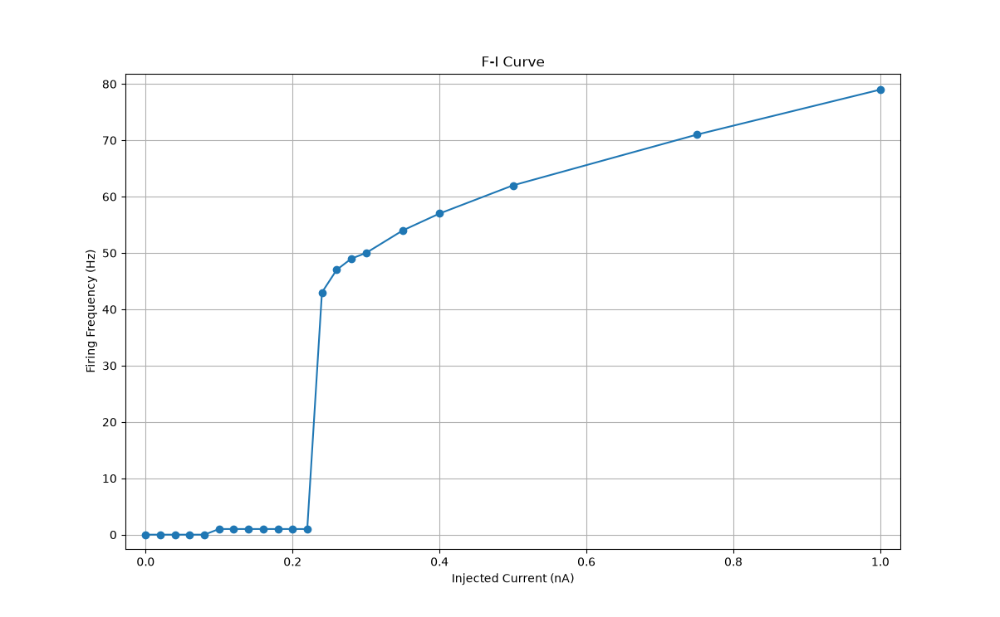
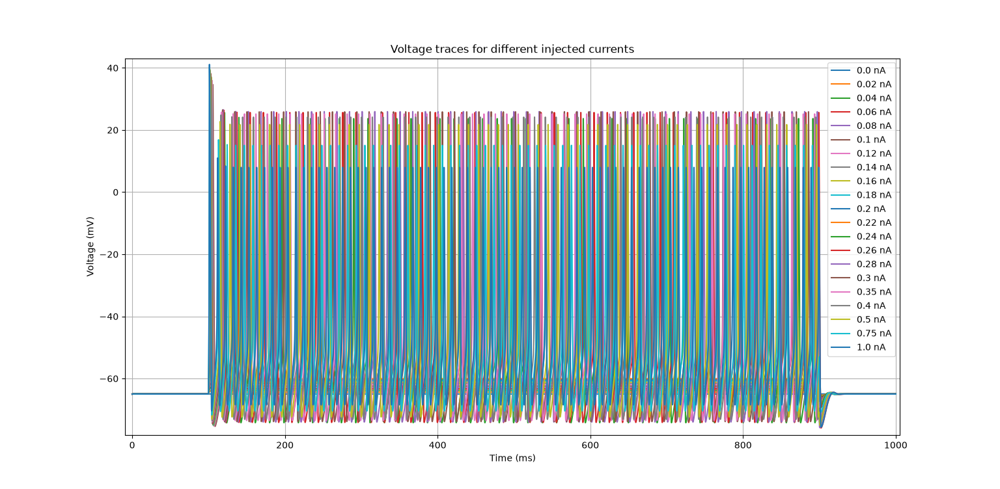
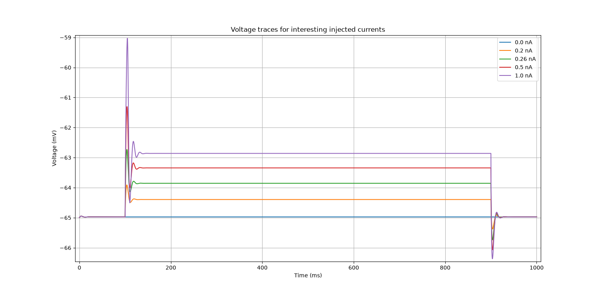

# Current Amplitude Vs Firing Frequency

## 1. Comparison Table
-----------------------------------------------------------------
Current     Spikes      Frequency      First spike
-----------------------------------------------------------------
0.0         0           0.00           -
0.02        0           0.00           -
0.04        0           0.00           -
0.06        0           0.00           -
0.08        0           0.00           -
0.1         1           1.00           105.40 ms
0.12        1           1.00           104.23 ms
0.14        1           1.00           103.60 ms
0.16        1           1.00           103.20 ms
0.18        1           1.00           102.88 ms
0.2         1           1.00           102.65 ms
0.22        1           1.00           102.45 ms
0.24        43          43.00          102.30 ms
0.26        47          47.00          102.18 ms
0.28        49          49.00          102.05 ms
0.3         50          50.00          101.95 ms
0.35        54          54.00          101.75 ms
0.4         57          57.00          101.60 ms
0.5         62          62.00          101.38 ms
0.75        71          71.00          101.08 ms
1.0         79          79.00          100.90 ms

## 2. F-I Curve

## 3. Voltage Traces For Every Injected Currents

## 4. Voltage Traces For Interesting Injected Currents

