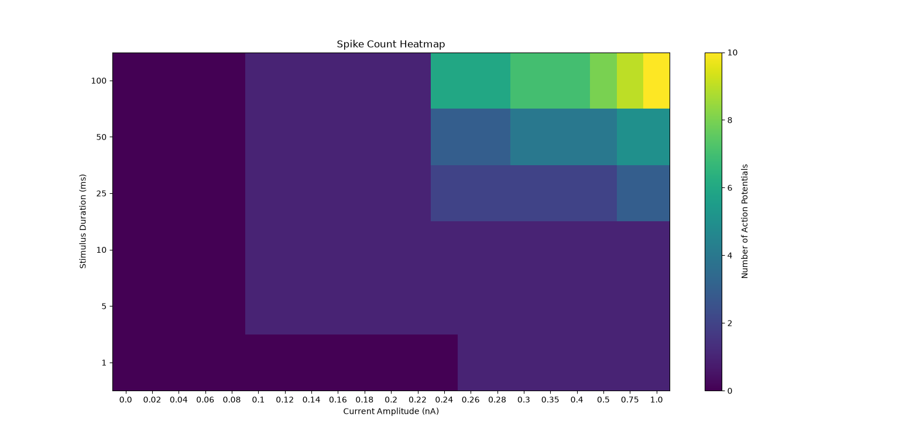

# Stimulus Duration Vs Action Potentials

At the end of this experiment we are able to observe through a Heat Map the spike count. After developing a Matrix that includes the variation of the current amplitude and the duration of the current injection.

This is the matrix:

**Spike Count Matrix**

[0, 0, 0, 0, 0, 0, 0, 0, 0, 0, 0, 0, 0, 1, 1, 1, 1, 1, 1, 1, 1]

[0, 0, 0, 0, 0, 1, 1, 1, 1, 1, 1, 1, 1, 1, 1, 1, 1, 1, 1, 1, 1]

[0, 0, 0, 0, 0, 1, 1, 1, 1, 1, 1, 1, 1, 1, 1, 1, 1, 1, 1, 1, 1]

[0, 0, 0, 0, 0, 1, 1, 1, 1, 1, 1, 1, 2, 2, 2, 2, 2, 2, 2, 3, 3]

[0, 0, 0, 0, 0, 1, 1, 1, 1, 1, 1, 1, 3, 3, 3, 4, 4, 4, 4, 5, 5]

[0, 0, 0, 0, 0, 1, 1, 1, 1, 1, 1, 1, 6, 6, 6, 7, 7, 7, 8, 9, 10]

Using Python's library matplotlib, a color-Heatmap was plotted, in which we can confirm our hypothesis in which a higher duration of the stimulus translates into a higher number of action potentials.

