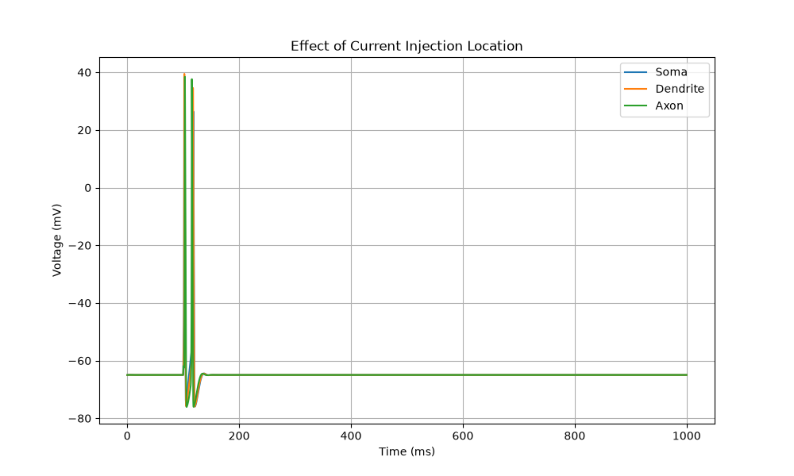
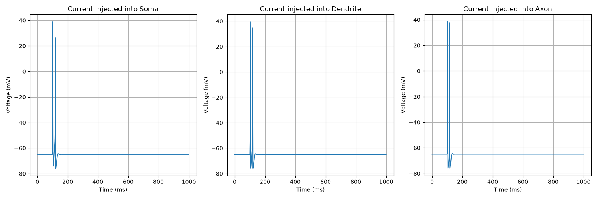
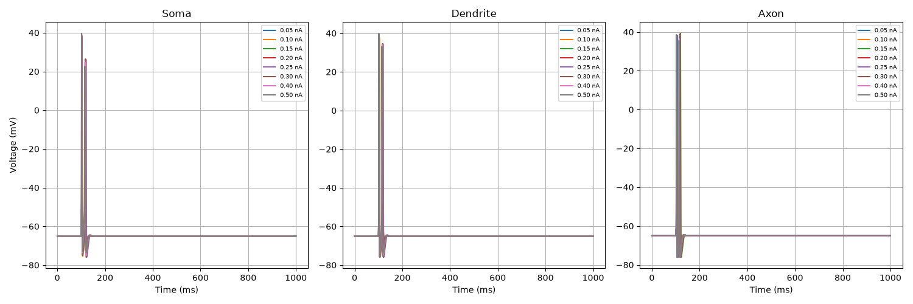

# Experiment 4 : where you inject current

## **Comparison between injection in soma,axon and dendrite** === "How does the location of stimulation affect the voltage observed at the soma?"

- change section: stim = h.IClamp(section(0.5))

**Peak voltages**
Soma:      38.85 mV at 101.90 ms
Dendrite:  39.49 mV at 102.13 ms
Axon:      38.44 mV at 103.08 ms

**Current= 0.30nA, 3 functions together**

**Current= 0.30nA, 3 functions in subplots**

**Different Currents, 3 functions in subplots**

Overall, we can state that there is not a really significant difference in a simple model made out of 1 soma, 1 axon and 1 dendrite. In the plots is really hard to tell, and in the peak voltages values we can see that when we inject the current to the soma the peak voltage is 1-2ms faster than the other sections. On the other hand, the injection to the dendrite shows a ~1mV of difference between the two. The importance of this values or the location will be observed in future experiments.

