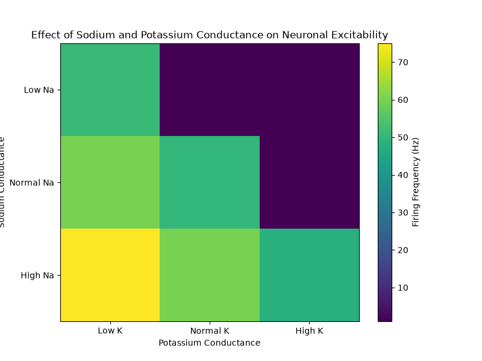

## Why does higher Na⁺ conductance produce more firing?

Increasing the sodium conductance (`gNa`) means that, during depolarization, the neuron can generate a larger and faster inward Na⁺ current. Sodium enters the neuron through voltage-dependent sodium channels, causing the membrane potential to depolarize rapidly. A higher sodium conductance makes it easier for the membrane to reach the threshold required to generate an action potential. After each action potential, the increased Na⁺ conductance also makes it easier for the neuron to reach threshold again, allowing the neuron to fire more frequently. This can be seen in the results: with normal K⁺ conductance, firing increases from **1 Hz** with low Na⁺ to **50 Hz** with normal Na⁺ and **60 Hz** with high Na⁺. With low K⁺ conductance, the effect is even stronger, increasing from **51 Hz** to **60 Hz** and then **75 Hz**.

However, sodium conductance does not determine neuronal excitability by itself. Potassium produces an outward current that opposes depolarization and contributes to the repolarization of the membrane after an action potential. Therefore, the balance between Na⁺ and K⁺ conductances is important. This can be observed in the experiment: when K⁺ conductance is high, low and normal Na⁺ produce only one action potential, while high Na⁺ produces 48 Hz. In contrast, when K⁺ conductance is low, the neuron fires much more frequently. These results demonstrate that neuronal excitability depends on the **balance between inward Na⁺ currents and outward K⁺ currents**, rather than on sodium conductance alone.

### Experimental Results

| Na⁺ Conductance | K⁺ Conductance | Spikes | Frequency (Hz) |
|---|---|---:|---:|
| Low Na | Low K | 51 | 51.0 |
| Low Na | Normal K | 1 | 1.0 |
| Low Na | High K | 1 | 1.0 |
| Normal Na | Low K | 60 | 60.0 |
| Normal Na | Normal K | 50 | 50.0 |
| Normal Na | High K | 1 | 1.0 |
| High Na | Low K | 75 | 75.0 |
| High Na | Normal K | 60 | 60.0 |
| High Na | High K | 48 | 48.0 |

### Conclusion

The results show that increasing Na⁺ conductance generally increases neuronal firing because it strengthens the inward current responsible for depolarization. However, increasing K⁺ conductance can strongly reduce excitability by increasing the outward current that opposes depolarization. Therefore, the firing behavior of the neuron is determined by the **balance between Na⁺ and K⁺ conductances**.

